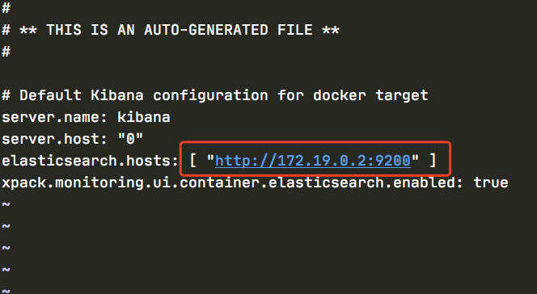
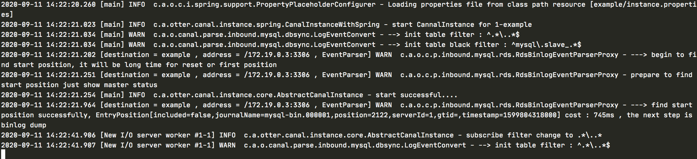
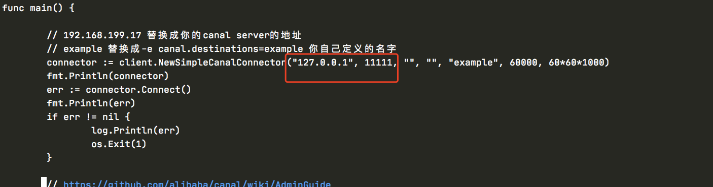
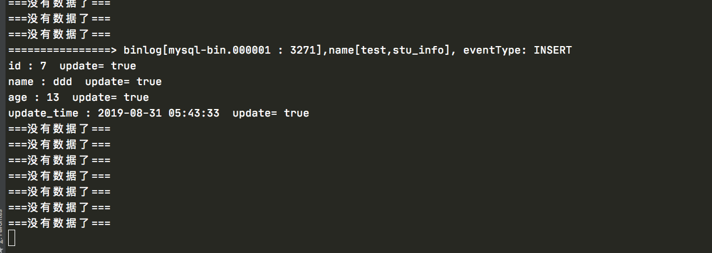

基于docker 搭建

https://www.elastic.co/guide/en/elasticsearch/reference/7.5/docker.html

# ElasticSearch 集群搭建

<font color=red size=5x>拉取镜像</font>

```
docker pull elasticsearch:6.8.12
```

<font color=red size=5x>编写docker-compose文件</font>

```
version: '2.2'
services:
  es01:
    image: docker.elastic.co/elasticsearch/elasticsearch:6.8.11
    container_name: es01
    environment:
      - node.name=es01
      - cluster.name=es-docker-cluster
      - discovery.zen.ping.unicast.hosts=es02,es03
      - bootstrap.memory_lock=true
      - "ES_JAVA_OPTS=-Xms512m -Xmx512m"
    ulimits:
      memlock:
        soft: -1
        hard: -1
    volumes:
      - data1:/usr/share/elasticsearch/data
    ports:
      - 9200:9200
    networks:
      elastic:
        ipv4_address: 172.19.0.2
  es02:
    image: docker.elastic.co/elasticsearch/elasticsearch:6.8.11
    container_name: es02
    environment:
      - node.name=es02
      - cluster.name=es-docker-cluster
      - discovery.zen.ping.unicast.hosts=es01,es03
      - bootstrap.memory_lock=true
      - "ES_JAVA_OPTS=-Xms512m -Xmx512m"
    ulimits:
      memlock:
        soft: -1
        hard: -1
    volumes:
      - data2:/usr/share/elasticsearch/data
    networks:
      - elastic
  es03:
    image: docker.elastic.co/elasticsearch/elasticsearch:6.8.11
    container_name: es03
    environment:
      - node.name=es03
      - cluster.name=es-docker-cluster
      - discovery.zen.ping.unicast.hosts=es01,es02
      - bootstrap.memory_lock=true
      - "ES_JAVA_OPTS=-Xms512m -Xmx512m"
    ulimits:
      memlock:
        soft: -1
        hard: -1
    volumes:
      - data3:/usr/share/elasticsearch/data
    networks:
      - elastic

volumes:
  data1:
    driver: local
  data2:
    driver: local
  data3:
    driver: local

networks:
  elastic:
    driver: bridge


```

<font color=red size=5x>启动容器</font>

```
docker-compose up -d 
```

# 搭建kibana

<font color=red size=5x>下载kibana镜像</font>

```
docker pull kibana:6.8.12
```

<font color=red size=5x>启动镜像&加入ES网络</font>

ELASTICSEARCH_URL 改为ES的地址和端口

```
docker run -d -p 5601:5601  -e ELASTICSEARCH_URL=http://172.19.0.2:9200  --ip 172.19.0.5 --name kibana  --network es_elastic  kibana:6.8.11

```

<font color=red size=5x>修改es监控地址</font>

```
docker exec -it kibana bash
vi config/kibana.yml

```




<font color=red size=5x>访问</font>

```
http://localhost:5601/app/kibana#/home?_g=()
```


<font color=red size=5x>测试</font>

```
PUT /lib/
{
  "settings": {
    "index":{
      "number_of_shards":3,
      "number_of_replicas":0
    }
  }
  
}
```

<font color=red size=5x>这样就是成功了</font>


# 安装分词器

<font color=red size=5x>local下压缩包</font>

```
wget https://github.com/medcl/elasticsearch-analysis-ik/releases/download/v6.8.11/elasticsearch-analysis-ik-6.8.11.zip

```

<font color=red size=5x>进入es创建目录</font>

几个节点都要做

```
docker exec -it es01 bash
[root@eec128cb0809 elasticsearch]# cd plugins/
[root@eec128cb0809 plugins]# mkdir ik
[root@eec128cb0809 plugins]# cd ik
[root@eec128cb0809 ik]# 

```

<font color=red size=5x>退回宿主机exit&cp分词器</font>

```
docker cp /Users/zhangsan/Desktop/workspace-app/es/elasticsearch-analysis-ik-6.8.11.zip es01:/usr/share/elasticsearch/plugins/ik

docker cp /Users/zhangsan/Desktop/workspace-app/es/elasticsearch-analysis-ik-6.8.11.zip es02:/usr/share/elasticsearch/plugins/ik

docker cp /Users/zhangsan/Desktop/workspace-app/es/elasticsearch-analysis-ik-6.8.11.zip es03:/usr/share/elasticsearch/plugins/ik


```

<font color=red size=5x>分别进入容器进行解压</font>

```
unzip elasticsearch-analysis-ik-6.8.11.zip
```

<font color=red size=5x>重启容器，安装完毕</font>

# 安装mysql

```
docker run -p 12345:3306 --name=mysql -v /Users/zhangsan/Desktop/workspace-app/mysql/conf:/etc/mysql/conf.d -v /Users/zhangsan/Desktop/workspace-app/mysql/logs:/logs -v /Users/zhangsan/Desktop/workspace-app/mysql/data:/var/lib/mysql -e MYSQL_ROOT_PASSWORD=123456 -d --net es_elastic --ip 172.19.0.6 mysql:5.7.25


```

<font color=red size=5x>Navicat连接mysql</font>

<font color=red size=5x>开启mysql的bin_log</font>

运行时需要注意确保mysql开启了bin_log，因为canal的原理是基于bin_log来实现的。
验证方法为：

```
mysql> show variables like 'binlog_format';
+---------------+-------+
| Variable_name | Value |
+---------------+-------+
| binlog_format | ROW   |
+---------------+-------+

mysql> show variables like 'log_bin';
+---------------+-------+
| Variable_name | Value |
+---------------+-------+
| log_bin       | ON    |
+---------------+-------+
12345678910111213
```

如上上面的语句返回的为ROW和ON，则说明是开启了bin_log的

如果没有开启可以参考canal的wiki，地址为：https://github.com/alibaba/canal/wiki/AdminGuide

```
[mysqld]  
log-bin=mysql-bin #添加这一行就ok  
binlog-format=ROW #选择row模式  
server_id=1 #配置mysql replaction需要定义，不能和canal的slaveId重复  
1234
```

在docker中可通过进入容器的bash进行配置：

```
docker exec -it dockermysql bash
vi /etc/mysql/mysql.conf.d/mysqld.cnf 


echo '[mysqld]' >> /etc/mysql/conf.d/mysql.cnf
echo 'log-bin=mysql-bin' >> /etc/mysql/conf.d/mysql.cnf
echo 'binlog-format=ROW' >> /etc/mysql/conf.d/mysql.cnf
echo 'server-id=123454' >> /etc/mysql/conf.d/mysql.cnf
```

<font color=red size=5x>创建用户</font>

```
mysql -uroot -proot
# 创建账号
CREATE USER canal IDENTIFIED BY 'canal'; 
# 授予权限
GRANT SELECT, REPLICATION SLAVE, REPLICATION CLIENT ON *.* TO 'canal'@'%';
-- GRANT ALL PRIVILEGES ON *.* TO 'canal'@'%' ;
# 刷新并应用
FLUSH PRIVILEGES;
```

# 安装canal-server

<font color=red size=5x>一定要加入es的网络中</font>

```
## 命令介绍
--net mynetwork #使用自定义网络
--ip   #指定分配ip
docker pull canal/canal-server

docker run -d -p 11111:11111 -p 11110:11110 -p 11112:11112 --name canal-server --network=es_elastic  --ip 172.19.0.7 canal/canal-server
```

进入canal-server容器

docker exec -it canal-server bash

编辑canal-server的配置

vi canal-server/conf/example/instance.properties


重启canal-server容器docker restart canal-server 进入容器查看启动日志：

```
docker exec -it canal-server bash
tail -100f canal-server/logs/example/example.log
```




# 安装canal-client

```
git clone https://github.com/withlin/canal-go.git
```

```
tree canal-go -d
```

```
canal-go
├── assets
├── client
├── docker
│   ├── canal-server-logs
│   ├── example
│   ├── mysql
│   │   └── init
│   └── var
│       └── lib
│           └── mysql
├── protocol
│   ├── Position
│   └── exception
├── samples
│   └── cluster
└── vendor
    └── github.com
        ├── gogo
        │   └── protobuf
        │       └── proto
        ├── golang
        │   └── protobuf
        │       └── proto
        └── samuel
            └── go-zookeeper
                └── zk
```


```
cd canal-go/samples
vim main.go
```

<font color=red size=5x>修改链接地址</font>



<font color=red size=5x>go run main.go</font>


<font color=red size=5x>在库中插入一条数据</font>


```
INSERT INTO `stu_info` VALUES ('7', 'ddd', '13', '2019-08-31 05:43:33');
```



# 安装canal-adapter

<font color=red size=5x>adapter需要jdk环境，复制容器</font>

```
docker export 6dfac71165f1 > canal-server.tar
docker import canal-server.tar canal-adapter:v1
docker run -d  --name canal-adapters --network=es_elastic --ip 172.19.0.8 b07a25a075bc bash
```

<font color=red size=5x>启动容器</font>

```
docker run -d  --name canal-adapter --network=es_elastic  --ip 172.19.0.8 canal/canal-server

```

<font color=red size=5x>进入容器创建目录&复制adapter</font>

```
docker cp /Users/zhangsan/Desktop/workspace-app/canal.adapter-1.1.3 canal-adapter:/home/adapter
```


https://blog.csdn.net/daziyuanazhen/article/details/106098887#%E4%BA%94%E3%80%81canal-adapter

