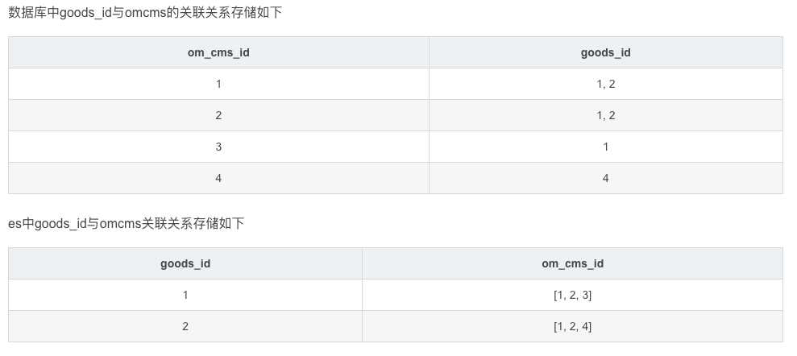

# 1 包及文章信息

- [github](https://github.com/olivere/elastic/)

- [原生语句基础操作](https://mp.weixin.qq.com/s?__biz=MzkyNzI1NzM5NQ==&mid=2247484756&idx=1&sn=6029ed72391e175ebef3de47bf9290a2&source=41#wechat_redirect)
  - 2
- [go-package基本操作](https://studygolang.com/articles/30672?fr=sidebar)
  - 3-9
- [es基础操作语法](https://www.tizi365.com/archives/617.html)
- [聚合分析](https://www.tizi365.com/archives/644.html)

# 2 基础字段

## 2.0. 存储结构

大家对mysq的存储结构应该是很清楚的，所以咱们在学习ES存储结构时，同时类比mysql，这样理解起来会更透彻。mysql的数据模型由数据库、表、字段、字段类型组成，自然ES也有自己的一套存储结构。

先看一个表格，然后我们在展开学习每一部分。

| ES存储结构    | Mysql存储结构 |
| :------------ | :------------ |
| Index（索引） | 表            |
| 文档          | 行，一行数据  |
| Field（字段） | 表字段        |
| mapping(映射) | 表结构定义    |

## 2.1 index

`ES`中索引(index)就像`mysql`中的表一样，代表着文档数据的集合，文档就相当于`ES`中存储的一条数据，下面会详细介绍。

## 2.2 type

type也就是文档类型，不过在`Elasticsearch7.0`以后的版本,已经废弃文档类型了。不过我们还是要知道这个概念的。在`Elasticsearch`老的版本中文档类型，代表一类文档的集合，index(索引)类似mysql的数据库、文档类型类似Mysql的表。既然新的版本文档类型没什么作用了，那么index（索引）就类似mysql的表的概念，ES没有数据库的概念了。

## 2.3 document

`ES`是面向文档的数据库，文档是`ES`存储的最基本的存储单元，文档类似`mysql`表中的一行数据。其实在`ES`中，文档指的就是一条JSON数据。`ES`中文档使用`JSON`格式存储，因此存储上要比`mysql`灵活的很多，因为`ES`支持任意格式的`json`数据。

举个例子吧：

```
{
  "_index" : "order",
  "_type" : "_doc",
  "_id" : "1",
  "_version" : 2,
  "_seq_no" : 1,
  "_primary_term" : 1,
  "found" : true,
  "_source" : {
    "id" : 10000,
    "status" : 0,
    "total_price" : 10000,
    "create_time" : "2020-09-06 17:30:22",
    "user" : {
      "id" : 10000,
      "username" : "asong2020",
      "phone" : "888888888",
      "address" : "深圳人才区"
    }
  }
}
```

这个是`kibana`的一条数据。文档中的任何`json`字段都可以作为查询条件。并且文档的`json`格式没有严格限制，可以随意增加，减少字段，甚至每个文档的格式都不一样也可以。

**注意：**这里我特意加粗了，虽然文档格式是没有限制的，可以随便存储数据，但是，我们在实际开发中是不可以这么做的，下一篇具体实战当中，我会进行讲解。我们在实际项目开发中，一个索引只会存储格式相同的数据。

上面我们已经看到了一个文档数据，下面我们来了解一下什么是文档元数据，指的是插入JSON文档的时候，`ES`为这条数据，自动生成的系统字段。我们常用的元数据如下：

- _index：代表当前`json`文档所属的文档名字
- _type：代表当前`json`文档所属的类型。不过在`es7.0`以后废弃了`type`用法，但是元数据还是可以看到的
- _id：文档唯一`ID`，如果我们没有为文档指定`id`，系统自动生成。
- _source：代表我们插入进入`json`数据
- _version：文档的版本号，每修改一次文档数据，字段就会加1，这个字段新版`es`也给取消了
- _seq_no：文档的编号，替代老的 version字段
- _primary_term：文档所在主分区，这个可以跟seq_no字段搭配实现乐观锁

## 2.4 Field

文档由多个`json`字段，这个字段跟`mysql`中的表的字段是类似的。`ES`中的字段也是有类型的，常用字段类型有：

- 数值类型(long、integer、short、byte、double、float)
- Date 日期类型
- boolean布尔类型
- Text 支持全文搜索
- Keyword 不支持全文搜索，例如：phone这种数据，用一个整体进行匹配就`ok`了，也不要进行分词处理
- Geo 这里主要用于地理信息检索、多边形区域的表达。

## 2.5 mapping

`Elasticsearch`的`mapping`类似于`mysql`中的表结构体定义，每个索引都有一个映射的规则，我们可以通过定义索引的映射规则，提前定义好文档的`json`结构和字段类型，如果没有定义索引的映射规则，`ElasticSearch`会在写入数据的时候，根据我们写入的数据字段推测出对应的字段类型，相当于自动定义索引的映射规则。

**注意：**`ES`的自动映射是很方便的，但是实际业务中，对于关键字段类型，我们都是通常预先定义好，这样可以避免`ES`自动生成的字段类型不是你想要的类型。


# 3 基础查询

##  3.1 `ES`查询

在使用`ES`时，查询是我们经常使用的。所以我们来主要讲解一下查询。

来看一下查询的基本语法结构：

```
GET /{索引名}/_search
{
 "from" : 0,  // 搜索结果的开始位置
   "size" : 10, // 分页大小，也就是一次返回多少数据
   "_source" :[ ...需要返回的字段数组... ],
 "query" : { ...query子句... },
 "aggs" : { ..aggs子句..  },
 "sort" : { ..sort子句..  }
}
```

让我们来依次解释一下每部分：

先看一下`URI`部分，{索引名}是我们要搜索的索引，可以放置多个索引，使用逗号进行分隔，比如：

```
GET /_order_demo1,_order_demo2/_search
GET /_order*/_search # 按前缀匹配索引名
```

查询结果：

```
{
  "took" : 0,
  "timed_out" : false,
  "_shards" : {
    "total" : 1,
    "successful" : 1,
    "skipped" : 0,
    "failed" : 0
  },
  "hits" : {
    "total" : {
      "value" : 1,
      "relation" : "eq"
    },
    "max_score" : 1.0,
    "hits" : [
      {
        "_index" : "order",
        "_type" : "_doc",
        "_id" : "1",
        "_score" : 1.0,
        "_source" : {
          "id" : 10000,
          "status" : 0,
          "total_price" : 10000,
          "create_time" : "2020-09-06 17:30:22",
          "user" : {
            "id" : 10000,
            "username" : "asong2020",
            "phone" : "888888888",
            "address" : "深圳人才区"
          }
        }
      }
    ]
  }
}
```

接下来我们一起看一看body中的查询条件：

- `ES`查询分页：通过`from`和`size`参数设置，相当于`MYSQL`的`limit`和`offset`结构,分页的最大数据量是1万
- `query`：主要编写类似SQL的Where语句，支持布尔查询（and/or）、IN、全文搜索、模糊匹配、范围查询（大于小于）
- `aggs`：主要用来编写统计分析语句，类似SQL的group by语句
- `sort`：用来设置排序条件，类似SQL的order by语句
- `source`：用于设置查询结果返回什么字段，相当于`select`语句后面指定字段

## 3.2 匹配单个字段

通过match实现全文索引，全文搜索是`ES`的关键特性之一，我们平时使用搜索一些文本、字符串是否包含指定的关键词，但是如果两篇文章，都包含我们的关键词，具体那篇文章内容的相关度更高？这个SQL的like语句是做不到的，更别说like语句的性能问题了。

ES通过分词处理、相关度计算可以解决这个问题，ES内置了一些相关度算法，例如：TF/IDF算法，大体上思想就是，如果一个关键词在一篇文章出现的频率高，并且在其他文章中出现的少，那说明这个关键词与这篇文章的相关度很高。分词就是为了提取搜索关键词，理解搜索的意图。就好像我们平常使用谷歌搜索的时候，输入的内容可能很长，但不是每个字都对搜索有帮助，所以可以通过粉刺算法，我们输入的搜索关键词，会进一步分解成多个关键词。这里具体的分词算法我就不详细讲解了，有需要的去官方文档看一看更详细的介绍吧。

我们先来看一看匹配单个字段的使用方法：

```
GET /{索引名}/_search
{
  "query": {
    "match": {
      "{FIELD}": "{TEXT}"
    }
  }
}
```

说明：

- {FIELD}  就是我们需要匹配的字段名
- {TEXT} 就是我们需要匹配的内容
- 精确匹配单个字段

当我们需要根据手机号、用户名来搜索一个用户信息时，这就需要使用精确匹配了。可以使用`term`实现精确匹配语法：

```
GET /{索引名}/_search
{
  "query": {
    "term": {
      "{FIELD}": "{VALUE}"
    }
  }
}
```

说明：

- {FIELD} - 就是我们需要匹配的字段名
- {VALUE} - 就是我们需要匹配的内容，除了TEXT类型字段以外的任意类型。
- 多值匹配

多值匹配，也就是想`mysql`中的in语句一样，一个字段包含给定数组中的任意一个值匹配。上文使用`term`实现单值精确匹配，同理`terms`就可以实现多值匹配。

```
GET /{索引名}/_search
{
  "query": {
    "terms": {
      "{FIELD}": [
        "{VALUE1}",
        "{VALUE2}"
      ]
    }
  }
}
```

说明：

- {FIELD} - 就是我们需要匹配的字段名
- {VALUE1}, {VALUE2} .... {VALUE N} - 就是我们需要匹配的内容，除了TEXT类型字段以外的任意类型。
- 范围查询

我们想通过范围来确实查询数据，这时应该怎么做呢？不要慌，当然有办法了，使用`range`就可以实现范围查询，相当于SQL语句的>，>=，<，<=表达式

```
GET /{索引名}/_search
{
  "query": {
    "range": {
      "{FIELD}": {
        "gte": 100, 
        "lte": 200
      }
    }
  }
}
```

说明：

- {FIELD} - 字段名
- gte范围参数 - 等价于>=
- lte范围参数 - 等价于 <=
- 范围参数可以只写一个，例如：仅保留 "gte": 100， 则代表 FIELD字段 >= 100

范围参数有如下：

- **gt** - 大于 （ > ）
- **gte** - 大于且等于 （ >= ）
- **lt** - 小于 （ < ）
- **lte** - 小于且等于 （ <= ）
- bool组合查询

前面的查询都是设置单个字段的查询条件，实际项目中这么应用是很少的，基本都是多个字段的查询条件，所以接下来我们就来一起学习一下组合多个字段的查询条件。

我们先来看一下`bool`查询的基本语法结构：

```
GET /{索引名}/_search
{
  "query": {
    "bool": { // bool查询
      "must": [], // must条件，类似SQL中的and, 代表必须匹配条件
      "must_not": [], // must_not条件，跟must相反，必须不匹配条件
      "should": [] // should条件，类似SQL中or, 代表匹配其中一个条件
    }
  }
}
```

接下来分析一下每个条件：

- must条件：类似SQL的and，代表必须匹配的条件。
- must_not条件：跟must作用刚好相反，相当于`sql`语句中的 `!=`
- should条件：类似SQL中的 or， 只要匹配其中一个条件即可

## 3.3  排序

假设我们现在要查询订单列表，那么返回符合条件的列表肯定不会是无序的，一般都是按照时间进行排序的，所以我们就要使用到了排序语句。`ES`的默认排序是根据相关性分数排序，如果我们想根据查询结果中的指定字段排序，需要使用`sort Processors`处理。

```
GET /{索引名}/_search
{
  "query": {
    ...查询条件....
  },
  "sort": [
    {
      "{Field1}": { // 排序字段1
        "order": "desc" // 排序方向，asc或者desc, 升序和降序
      }
    },
    {
      "{Field2}": { // 排序字段2
        "order": "desc" // 排序方向，asc或者desc, 升序和降序
      }
    }
    ....多个排序字段.....
  ]
}
```

sort子句支持多个字段排序，类似SQL的order by。

## 3.4 聚合查询

`ES`中的聚合查询，类似`SQL`的SUM/AVG/COUNT/GROUP BY分组查询，主要用于统计分析场景。

我们先来看一看什么是聚合查询：

ES聚合查询类似SQL的GROUP by，一般统计分析主要分为两个步骤：

- 分组
- 组内聚合

对查询的数据首先进行一轮分组，可以设置分组条件，例如：新生入学，把所有的学生按专业分班，这个分班的过程就是对学生进行了分组。

组内聚合，就是对组内的数据进行统计，例如：计算总数、求平均值等等，接上面的例子，学生都按专业分班了，那么就可以统计每个班的学生总数， 这个统计每个班学生总数的计算，就是组内聚合计算。

知道了什么是聚合，下面我们就来看其中几个重要关键字：

- 桶：桶的就是一组数据的集合，对数据分组后，得到一组组的数据，就是一个个的桶。ES中桶聚合，指的就是先对数据进行分组。
- 指标：指标指的是对文档进行统计计算方式，又叫指标聚合。桶内聚合，说的就是先对数据进行分组（分桶），然后对每一个桶内的数据进行指标聚合。说白了就是，前面将数据经过一轮桶聚合，把数据分成一个个的桶之后，我们根据上面计算指标对桶内的数据进行统计。常用的指标有：SUM、COUNT、MAX等统计函数。

了解了真正的概念，我们就可以学习聚合查询的语法了：

```
{
  "aggregations" : {
    "<aggregation_name>" : {
        "<aggregation_type>" : {
            <aggregation_body>
        }
        [,"aggregations" : { [<sub_aggregation>]+ } ]? // 嵌套聚合查询，支持多层嵌套
    }
    [,"<aggregation_name_2>" : { ... } ]* // 多个聚合查询，每个聚合查询取不同的名字
  }
}
```

说明：

- **aggregations** - 代表聚合查询语句，可以简写为aggs
- **<aggregation_name>** - 代表一个聚合计算的名字，可以随意命名，因为ES支持一次进行多次统计分析查询，后面需要通过这个名字在查询结果中找到我们想要的计算结果。
- **<aggregation_type>** - 聚合类型，代表我们想要怎么统计数据，主要有两大类聚合类型，桶聚合和指标聚合，这两类聚合又包括多种聚合类型，例如：指标聚合：sum、avg， 桶聚合：terms、Date histogram等等。
- **<aggregation_body>** - 聚合类型的参数，选择不同的聚合类型，有不同的参数。
- **aggregation_name_2** - 代表其他聚合计算的名字，意思就是可以一次进行多种类型的统计。

光看这个查询语法，大家可能是懵逼的，所以我们来举个例子，更好的理解一下：

假设现在`order`索引中，存储了每一笔外卖订单，里面包含了店铺名字这个字段，那我们想要统计每个店铺的订单数量，就需要用到聚合查询。

```
GET /order/_search
{
    "size" : 0, // 设置size=0的意思就是，仅返回聚合查询结果，不返回普通query查询结果。
    "aggs" : { // 简写
        "count_store" : { // 聚合查询名字
            "terms" : { // 聚合类型为，terms，terms是桶聚合的一种，类似SQL的group by的作用，根据字段分组，相同字段值的文档分为一组。
              "field" : "store_name" // terms聚合类型的参数，这里需要设置分组的字段为store_name，根据store_name分组
            }
        }
    }
}
```

这里我们没有明确指定指标聚合函数，默认使用的是Value Count聚合指标统计文档总数。

接下来我们就来介绍一下各个指标聚合函数:

- Value Count：值聚合，主要用于统计文档总数，类似SQL的count函数。

```
GET /sales/_search?size=0
{
  "aggs": {
    "types_count": { // 聚合查询的名字，随便取个名字
      "value_count": { // 聚合类型为：value_count
        "field": "type" // 计算type这个字段值的总数
      }
    }
  }
}
```

- cardinality

基数聚合，也是用于统计文档的总数，跟Value Count的区别是，基数聚合会去重，不会统计重复的值，类似SQL的count(DISTINCT 字段)用法。

```
POST /sales/_search?size=0
{
    "aggs" : {
        "type_count" : { // 聚合查询的名字，随便取一个
            "cardinality" : { // 聚合查询类型为：cardinality
                "field" : "type" // 根据type这个字段统计文档总数
            }
        }
    }
}
```

- avg

求平均值

```
POST /exams/_search?size=0
{
  "aggs": {
    "avg_grade": { // 聚合查询名字，随便取一个名字
      "avg": { // 聚合查询类型为: avg
        "field": "grade" // 统计grade字段值的平均值
      }
    }
  }
}
```

- Sum

求和计算

```
POST /sales/_search?size=0
{
  "aggs": {
    "hat_prices": { // 聚合查询名字，随便取一个名字
      "sum": { // 聚合类型为：sum
        "field": "price" // 计算price字段值的总和
      }
    }
  }
}
```

- max

求最大值

```
POST /sales/_search?size=0
{
  "aggs": {
    "max_price": { // 聚合查询名字,随便取一个名字
      "max": { // 聚合类型为：max
        "field": "price" // 求price字段的最大值
      }
    }
  }
}
```

- min

求最小值

```
POST /sales/_search?size=0
{
  "aggs": {
    "min_price": { // 聚合查询名字，随便取一个
      "min": { // 聚合类型为: min
        "field": "price" // 求price字段值的最小值
      }
    }
  }
}
```

# 4 go-package 建立连接

```
package main

import (
	"fmt"
	"github.com/olivere/elastic"
	"log"
	"os"
)

// -- --------------------------
// --> @Describe
// --> @params
// --> @return
// -- ------------------------------------
func main() {

}

func NewEsClient(conf *config.ServerConfig) *elastic.Client {
	url := fmt.Sprintf("http://%s:%d", conf.Elastic.Host, conf.Elastic.Port)
	client, err := elastic.NewClient(
		//elastic 服务地址
		elastic.SetURL(url),
		// 设置错误日志输出
		elastic.SetErrorLog(log.New(os.Stderr, "ELASTIC ", log.LstdFlags)),
		// 设置info日志输出
		//elastic.SetInfoLog(log.New(os.Stdout, "", log.LstdFlags)))
		//自定义日志输出格式
		elastic.SetTraceLog(Debug{}),
	if err != nil {
		log.Fatalln("Failed to create elastic client")
	}
	return client
}

// Debug 实现 elastic.Logger 接口
type Debug struct{}

// Printf  实现输出
func (Debug) Printf(format string, v ...interface{}) {
	fmt.Printf(format, v...)
}
```

- `elastic.SetURL(url)`用来设置`ES`服务地址，如果是本地，就是`127.0.0.1:9200`。支持多个地址，用逗号分隔即可。
- `elastic.SetBasicAuth("user", "secret")`这个是基于http base auth 验证机制的账号密码。
- `elastic.SetGzip(true)`启动`gzip`压缩
- `elastic.SetHealthcheckInterval(10*time.Second)`用来设置监控检查时间间隔
- `elastic.SetMaxRetries(5)`设置请求失败最大重试次数，v7版本以后已被弃用
- `elastic.SetSniff(false)`允许指定弹性是否应该定期检查集群（默认为true）
- `elastic.SetErrorLog(log.New(os.Stderr, "ELASTIC ", log.LstdFlags))` 设置错误日志输出
- `elastic.SetInfoLog(log.New(os.Stdout, "", log.LstdFlags))` 设置info日志输出
- `SetDecoder()` 数据推送使用的json


可设置的参数

```
用于请求的c*http.Client//net/http客户端


connsMu sync.RWMutex//connsMu保护下一个块

conns[]*conn//所有连接

cindex int//索引到conns


mu sync.RWMutex//保护下一个块

urls[]字符串//最初传递给客户端的URL集

如果客户端的后台进程正在运行，则运行bool//true

errorlog记录器//关键消息的错误日志

infolog记录器//例如响应时间的信息日志

tracelog记录器//用于调试的跟踪日志

depositionlog函数（*http.Request，*http.Response）

scheme字符串//http或https

healthcheckEnabled bool//启用或禁用healthchecks

healthcheck超时启动时间。持续时间//healthcheck在启动时等待Elasticsearch响应的时间

healthcheck超时时间。持续时间//healthcheck等待Elasticsearch响应的时间

healthcheck间隔时间。持续时间//健康检查之间的间隔

healthcheckStop chan bool//通知healthchecker停止，并通知返回

嗅探器启用布尔//嗅探器启用或禁用

snifferTimeoutStartup时间。持续时间//嗅探器在启动时等待来自节点信息API的响应的时间

snifferTimeout时间。持续时间//嗅探器等待来自节点信息API的响应的时间

嗅探器间隔时间。持续时间//嗅探之间的间隔

snifferCallback snifferCallback//回调以修改嗅探决定

嗅探器停止chan bool//通知嗅探器停止，并通知返回

decoder解码器//用于解码Elasticsearch发送的数据

basicAuth bool//指示是否发送HTTP基本身份验证凭据

basicAuthUsername字符串//HTTP基本身份验证的用户名

basicAuthPassword字符串//HTTP基本身份验证的密码

sendGetBodyAs字符串//在发送带有正文的GET时重写

gzip启用bool//启用或禁用gzip压缩（默认）

requiredPlugins[]字符串//所需插件列表

retrier重试//重试策略

headers http.Header//添加到每个请求的默认标头列表

}
```


# 5 创建index及mapping

上一步，我们创建了`client`，接下来我们就要创建对应的索引以及`mapping`。根据开始介绍的功能，我们来设计我们的`mapping`结构：

```
mappingTpl = `{
    "mappings":{
        "properties":{
            "id":                 { "type": "long" },
            "username":         { "type": "keyword" },
            "nickname":            { "type": "text" },
            "phone":            { "type": "keyword" },
            "age":                { "type": "long" },
            "ancestral":        { "type": "text" },
            "identity":         { "type": "text" },
            "update_time":        { "type": "long" },
            "create_time":        { "type": "long" }
            }
        }
    }`
```

索引设计为：`index =asong_golang_dream `。

设计好了index及`mapping`后，我们开始编写代码进行创建：

```
ctx := context.Background()

exists, err := es.client.IndexExists(es.index).Do(ctx)
if err != nil {
  fmt.Printf("userEs init exist failed err is %s\n", err)
  return
}

if !exists {
  _, err := es.client.CreateIndex(es.index).Body(es.mapping).Do(ctx)
  if err != nil {
    fmt.Printf("userEs init failed err is %s\n", err)
    return
  }
}
```

这里我们首先判断`es`中是否已经存在要创建的索引，不存在，调用`CreateIndex`进行创建。

# 6 批量添加

完成一切准备工作，我们接下来就该进行数据的增删改查了。目前该索引下是没有数据，我们先来学习批量添加，添加一些数据，方便后面的使用。

这里批量添加使用的是`bulk`API，`bulk`API允许在单个步骤中进行多次`create`、`index`，`update`、`delete`请求。如果你需要索引一个数据流比如日志事件，它可以排队和索引数百或数千批次。`bulk` 与其他的请求体格式稍有不同，如下所示：

```
{ action: { metadata }}\n
{ request body        }\n
{ action: { metadata }}\n
{ request body        }\n
...
```

这种格式类似一个有效的单行 JSON 文档 *流* ，它通过换行符(`\n`)连接到一起。注意两个要点：

- 每行一定要以换行符(`\n`)结尾， *包括最后一行* 。这些换行符被用作一个标记，可以有效分隔行。
- 这些行不能包含未转义的换行符，因为他们将会对解析造成干扰。这意味着这个 JSON *不* 能使用 pretty 参数打印。

`action/metadata` 行指定 *哪一个文档* 做 *什么操作* 。

`action` 必须是以下选项之一:

**`create`**：如果文档不存在，那么就创建它。

**`index`**：创建一个新文档或者替换一个现有的文档。

**`update`**：部分更新一个文档

**`delete`**：删除一个文档

这里我使用的是`index`，代码实现如下：

```
func (es *UserES) BatchAdd(ctx context.Context, user []*model.UserEs) error {
    var err error
    for i := 0; i < esRetryLimit; i++ {
        if err = es.batchAdd(ctx, user); err != nil {
            fmt.Println("batch add failed ", err)
            continue
        }
        return err
    }
    return err
}

func (es *UserES) batchAdd(ctx context.Context, user []*model.UserEs) error {
    req := es.client.Bulk().Index(es.index)
    for _, u := range user {
        u.UpdateTime = uint64(time.Now().UnixNano()) / uint64(time.Millisecond)
        u.CreateTime = uint64(time.Now().UnixNano()) / uint64(time.Millisecond)
        doc := elastic.NewBulkIndexRequest().Id(strconv.FormatUint(u.ID, 10)).Doc(u)
        req.Add(doc)
    }
    if req.NumberOfActions() < 0 {
        return nil
    }
    if _, err := req.Do(ctx); err != nil {
        return err
    }
    return nil
}
```

写好了代码，接下来我们就来测试一下，这个程序使用的`gin`框架，`API`：`http://localhost:8080/api/user/create`，运行代码，发送一个请求，测试一下：

```
$ curl --location --request POST 'http://localhost:8080/api/user/create' \
--header 'Content-Type: application/json' \
--data-raw '{
"id": 6,
"username": "asong6",
"nickname": "Golang梦工厂",
"phone": "17897875432",
"age": 20,
"ancestral": "吉林省深圳市",
"identity": "工人"
}'
```

返回结果：

```
{
    "code": 0,
    "msg": "success"
}
```

**注意：这里有一个点需要说一下，这里我加了一个`for`循环是为了做重试机制的，重试机会为3次，超过则返回。**

为了确保我们插入成功，可以验证一下，发送如下请求：

```
$ curl --location --request GET 'http://localhost:9200/asong_golang_dream/_search'
```

# 7  批量更新

上面介绍了`bulk`API，批量更新依然也是采用的这个方法，`action`选项为`update`。实现代码如下：

```
func (es *UserES) BatchUpdate(ctx context.Context, user []*model.UserEs) error {
    var err error
    for i := 0; i < esRetryLimit; i++ {
        if err = es.batchUpdate(ctx, user); err != nil {
            continue
        }
        return err
    }
    return err
}

func (es *UserES) batchUpdate(ctx context.Context, user []*model.UserEs) error {
    req := es.client.Bulk().Index(es.index)
    for _, u := range user {
        u.UpdateTime = uint64(time.Now().UnixNano()) / uint64(time.Millisecond)
        doc := elastic.NewBulkUpdateRequest().Id(strconv.FormatUint(u.ID, 10)).Doc(u)
        req.Add(doc)
    }

    if req.NumberOfActions() < 0 {
        return nil
    }
    if _, err := req.Do(ctx); err != nil {
        return err
    }
    return nil
}
```

验证一下：

```
$ curl --location --request PUT 'http://localhost:8080/api/user/update' \
--header 'Content-Type: application/json' \
--data-raw '{
"id": 1,
"username": "asong",
"nickname": "Golang梦工厂",
"phone": "17888889999",
"age": 21,
"ancestral": "吉林省",
"identity": "工人"
}'
```

结果：

```
{
    "code": 0,
    "msg": "success"
}
```

# 8  批量删除

批量删除也是采用的`bulk`API，即`action`选项为`delete`。代码实现如下：

```
func (es *UserES) BatchDel(ctx context.Context, user []*model.UserEs) error {
    var err error
    for i := 0; i < esRetryLimit; i++ {
        if err = es.batchDel(ctx, user); err != nil {
            continue
        }
        return err
    }
    return err
}

func (es *UserES) batchDel(ctx context.Context, user []*model.UserEs) error {
    req := es.client.Bulk().Index(es.index)
    for _, u := range user {
        doc := elastic.NewBulkDeleteRequest().Id(strconv.FormatUint(u.ID, 10))
        req.Add(doc)
    }

    if req.NumberOfActions() < 0 {
        return nil
    }

    if _, err := req.Do(ctx); err != nil {
        return err
    }
    return nil
}
```

测试一下：

```
curl --location --request DELETE 'http://localhost:8080/api/user/delete' \
--header 'Content-Type: application/json' \
--data-raw '{
"id": 1,
"username": "asong",
"nickname": "Golang梦工厂",
"phone": "17888889999",
"age": 21,
"ancestral": "吉林省",
"identity": "工人"
}'
```

#9 查询

有了数据，我们根据条件查询我们想要的数据了。这里我使用的是`bool`组合查询，这个查询语法，我在之前的文章也讲解过，不懂得可以先看一下这一篇文章：

[https://mp.weixin.qq.com/s/mV...](https://mp.weixin.qq.com/s/mV2hnfctQuRLRKpPPT9XRw)。

我们先看代码吧：

```
func (r *SearchRequest) ToFilter() *EsSearch {
    var search EsSearch
    if len(r.Nickname) != 0 {
        search.ShouldQuery = append(search.ShouldQuery, elastic.NewMatchQuery("nickname", r.Nickname))
    }
    if len(r.Phone) != 0 {
        search.ShouldQuery = append(search.ShouldQuery, elastic.NewTermsQuery("phone", r.Phone))
    }
    if len(r.Ancestral) != 0 {
        search.ShouldQuery = append(search.ShouldQuery, elastic.NewMatchQuery("ancestral", r.Ancestral))
    }
    if len(r.Identity) != 0 {
        search.ShouldQuery = append(search.ShouldQuery, elastic.NewMatchQuery("identity", r.Identity))
    }

    if search.Sorters == nil {
        search.Sorters = append(search.Sorters, elastic.NewFieldSort("create_time").Desc())
    }

    search.From = (r.Num - 1) * r.Size
    search.Size = r.Size
    return &search
}

func (es *UserES) Search(ctx context.Context, filter *model.EsSearch) ([]*model.UserEs, error) {
    boolQuery := elastic.NewBoolQuery()
    boolQuery.Must(filter.MustQuery...)
    boolQuery.MustNot(filter.MustNotQuery...)
    boolQuery.Should(filter.ShouldQuery...)
    boolQuery.Filter(filter.Filters...)

    // 当should不为空时，保证至少匹配should中的一项
    if len(filter.MustQuery) == 0 && len(filter.MustNotQuery) == 0 && len(filter.ShouldQuery) > 0 {
        boolQuery.MinimumShouldMatch("1")
    }

    service := es.client.Search().Index(es.index).Query(boolQuery).SortBy(filter.Sorters...).From(filter.From).Size(filter.Size)
    resp, err := service.Do(ctx)
    if err != nil {
        return nil, err
    }

    if resp.TotalHits() == 0 {
        return nil, nil
    }
    userES := make([]*model.UserEs, 0)
    for _, e := range resp.Each(reflect.TypeOf(&model.UserEs{})) {
        us := e.(*model.UserEs)
        userES = append(userES, us)
    }
    return userES, nil
}
```

我们查询之前进行了条件绑定，这个条件通过`API`进行设定的，根据条件绑定不同`query`。`phone`是具有唯一性的，所以我们可以采用精确查询，也就是使用`NewTermsQuery`进行绑定。`Nickname`、`Identity`、`Ancestral`这些都属于模糊查询，所以我们可以使用匹配查询，用`NewMatchQuery`进行绑定·。查询的数据我们在根据创建时间进行排序。时间由近到远进行排序。

代码量不是很多，看一篇就能懂了，我接下来测试一下：

```
$ curl --location --request POST 'http://localhost:8080/api/user/search' \
--header 'Content-Type: application/json' \
--data-raw '{
    "nickname": "",
    "phone": "",
    "identity": "",
    "ancestral": "吉林省",
    "num": 1,
    "size":10
}'
```

这里进行说明一下，使用`json`来选择不同的条件，需要那个条件就填写`json`就好了。这个测试的查询条件就是查找出籍贯是`吉林省`的用户列表，通过`num`、`size`限制查询数据量，即第一页，数据量为10。

验证结果：

```
{
    "code": 0,
    "data": [
        {
            "id": 6,
            "username": "asong6",
            "nickname": "Golang梦工厂",
            "phone": "17897875432",
            "age": 20,
            "ancestral": "吉林省吉林市",
            "identity": "工人",
            "update_time": 1599905564941,
            "create_time": 1599905564941
        },
        {
            "id": 2,
            "username": "asong2",
            "nickname": "Golang梦工厂",
            "phone": "17897873456",
            "age": 20,
            "ancestral": "吉林省吉林市",
            "identity": "学生",
            "update_time": 1599905468869,
            "create_time": 1599905468869
        },
        {
            "id": 1,
            "username": "asong1",
            "nickname": "Golang梦工厂",
            "phone": "17897870987",
            "age": 20,
            "ancestral": "吉林省吉林市",
            "identity": "工人",
            "update_time": 1599900090160,
            "create_time": 1599900090160
        }
    ],
    "msg": "success"
}
```

目前我的数据量没有那么大，所以只有三条数据，你们可以自己测试一下，添加更多的数据进行测试。

# 9 批量查询

在一些场景中，我们需要通过多个`ID`批量查询文档。`es`中提供了一个`multiGet`进行批量查询，不过我这里实现的不是用这个方法。因为用更好的方法可以使用。`multiGet`批量查询的实现是跟`redis`的`pipeline`是一个道理的，缓存所有请求，然后统一进行请求，所以这里只是减少了IO的使用。所以我们可以使用更好的方法，使用`search`查询，它提供了根据`id`查询的方法，这个方法是一次请求，完成所有的查询，更高效，所以推荐大家使用这个方法进行批量查询。

代码实现如下：

```
// 根据id 批量获取
func (es *UserES) MGet(ctx context.Context, IDS []uint64) ([]*model.UserEs, error) {
    userES := make([]*model.UserEs, 0, len(IDS))
    idStr := make([]string, 0, len(IDS))
    for _, id := range IDS {
        idStr = append(idStr, strconv.FormatUint(id, 10))
    }
    resp, err := es.client.Search(es.index).Query(
        elastic.NewIdsQuery().Ids(idStr...)).Size(len(IDS)).Do(ctx)

    if err != nil {
        return nil, err
    }

    if resp.TotalHits() == 0 {
        return nil, nil
    }
    for _, e := range resp.Each(reflect.TypeOf(&model.UserEs{})) {
        us := e.(*model.UserEs)
        userES = append(userES, us)
    }
    return userES, nil
}
```

好啦，写好了代码我们进行验证一下吧。

```
$ curl --location --request GET 'http://localhost:8080/api/user/info?id=1,2,3'
```

验证结果:

```
{
    "code": 0,
    "data": [
        {
            "id": 1,
            "username": "asong",
            "nickname": "Golang梦工厂",
            "phone": "88889999",
            "age": 18,
            "ancestral": "广东省深圳市",
            "identity": "工人"
        },
        {
            "id": 2,
            "username": "asong1",
            "nickname": "Golang梦工厂",
            "phone": "888809090",
            "age": 20,
            "ancestral": "吉林省吉林市",
            "identity": "学生"
        },
        {
            "id": 3,
            "username": "asong2",
            "nickname": "Golang梦工厂",
            "phone": "88343409090",
            "age": 21,
            "ancestral": "吉林省吉林市",
            "identity": "学生"
        }
    ],
    "msg": "success"
}
```


# 10 es 的几种查询 

## 10.1 精确匹配单个字段 term

elasticsearch的term查询，下面给出完整的代码

```
package main

import (
	"context"
	"fmt"
	"github.com/olivere/elastic/v7"
	"log"
	"os"
	"reflect"
	"time"
)

type Article struct {
	Title   string    // 文章标题
	Content string    // 文章内容
	Author  string    // 作者
	Created time.Time // 发布时间
}


func main() {
        // 创建Client, 连接ES
	client, err := elastic.NewClient(
		// elasticsearch 服务地址，多个服务地址使用逗号分隔
		elastic.SetURL("http://127.0.0.1:9200", "http://127.0.0.1:9201"),
		// 基于http base auth验证机制的账号和密码
		elastic.SetBasicAuth("user", "secret"),
		// 启用gzip压缩
		elastic.SetGzip(true),
		// 设置监控检查时间间隔
		elastic.SetHealthcheckInterval(10*time.Second),
		// 设置请求失败最大重试次数
		elastic.SetMaxRetries(5),
		// 设置错误日志输出
		elastic.SetErrorLog(log.New(os.Stderr, "ELASTIC ", log.LstdFlags)),
		// 设置info日志输出
		elastic.SetInfoLog(log.New(os.Stdout, "", log.LstdFlags)))

	if err != nil {
		// Handle error
		fmt.Printf("连接失败: %v\n", err)
	} else {
		fmt.Println("连接成功")
	}

	// 执行ES请求需要提供一个上下文对象
	ctx := context.Background()

	// 创建term查询条件，用于精确查询
	termQuery := elastic.NewTermQuery("Author", "tizi")
	
	searchResult, err := client.Search().
		Index("blogs").   // 设置索引名
		Query(termQuery).   // 设置查询条件
		Sort("Created", true). // 设置排序字段，根据Created字段升序排序，第二个参数false表示逆序
		From(0). // 设置分页参数 - 起始偏移量，从第0行记录开始
		Size(10).   // 设置分页参数 - 每页大小
		Pretty(true).       // 查询结果返回可读性较好的JSON格式
		Do(ctx)             // 执行请求

	if err != nil {
		// Handle error
		panic(err)
	}

	fmt.Printf("查询消耗时间 %d ms, 结果总数: %d\n", searchResult.TookInMillis, searchResult.TotalHits())


	if searchResult.TotalHits() > 0 {
		// 查询结果不为空，则遍历结果
		var b1 Article
		// 通过Each方法，将es结果的json结构转换成struct对象
		for _, item := range searchResult.Each(reflect.TypeOf(b1)) {
			// 转换成Article对象
			if t, ok := item.(Article); ok {
				fmt.Println(t.Title)
			}
		}
	}
}
```

> 提示：后续章节，仅给出关键代码片段，其他代码结构参考本节即可

## 10.2 通过terms实现SQL的in查询

通过terms查询语法实现，多值查询效果

例子：

```
// 创建terms查询条件
termsQuery := elastic.NewTermsQuery("Author", "tizi", "tizi365")

searchResult, err := client.Search().
		Index("blogs").   // 设置索引名
		Query(termsQuery).   // 设置查询条件
		Sort("Created", true). // 设置排序字段，根据Created字段升序排序，第二个参数false表示逆序
		From(0). // 设置分页参数 - 起始偏移量，从第0行记录开始
		Size(10).   // 设置分页参数 - 每页大小
		Do(ctx)             // 执行请求
```

## 10.3 匹配单个字段 match

某个字段使用全文搜索，也就是ES的match语法

例子：

```
// 创建match查询条件
matchQuery := elastic.NewMatchQuery("Title", "golang es教程")

searchResult, err := client.Search().
		Index("blogs").   // 设置索引名
		Query(matchQuery).   // 设置查询条件
		Sort("Created", true). // 设置排序字段，根据Created字段升序排序，第二个参数false表示逆序
		From(0). // 设置分页参数 - 起始偏移量，从第0行记录开始
		Size(10).   // 设置分页参数 - 每页大小
		Do(ctx) 
```

## 10.4 范围查询 range

实现类似Created > '2020-07-20' and Created < '2020-07-22'的范围查询条件

创建查询表达式例子：

```
// 例1 等价表达式： Created > "2020-07-20" and Created < "2020-07-29"
rangeQuery := elastic.NewRangeQuery("Created").
		Gt("2020-07-20").
		Lt("2020-07-29")

// 例2 等价表达式： id >= 1 and id < 10
rangeQuery := elastic.NewRangeQuery("id").
		Gte(1).
		Lte(10)
```

## 10.5  bool组合查询

bool组合查询，实际上就是组合了前面的查询条件，然后通过类似SQL语句的and和or将查询条件组合起来，不熟悉ES查询语法，请参考[ES教程](https://www.tizi365.com/archives/590.html)

###  10.5.1 must条件

类似SQL的and，代表必须匹配的条件。

```
// 创建bool查询
boolQuery := elastic.NewBoolQuery().Must()

// 创建term查询
termQuery := elastic.NewTermQuery("Author", "tizi")
matchQuery := elastic.NewMatchQuery("Title", "golang es教程")

// 设置bool查询的must条件, 组合了两个子查询
// 表示搜索匹配Author=tizi且Title匹配"golang es教程"的文档
boolQuery.Must(termQuery, matchQuery)

searchResult, err := client.Search().
		Index("blogs").   // 设置索引名
		Query(boolQuery).   // 设置查询条件
		Sort("Created", true). // 设置排序字段，根据Created字段升序排序，第二个参数false表示逆序
		From(0). // 设置分页参数 - 起始偏移量，从第0行记录开始
		Size(10).   // 设置分页参数 - 每页大小
		Do(ctx)             // 执行请求
```

### 10.5.2.must_not条件

跟must的作用相反，用法和must类似

```
// 创建bool查询
boolQuery := elastic.NewBoolQuery().Must()

// 创建term查询
termQuery := elastic.NewTermQuery("Author", "tizi")

// 设置bool查询的must not条件
boolQuery.MustNot(termQuery)
```

### 10.5.3 should条件

类似SQL中的 or， 只要匹配其中一个条件即可

```
// 创建bool查询
boolQuery := elastic.NewBoolQuery().Must()

// 创建term查询
termQuery := elastic.NewTermQuery("Author", "tizi")
matchQuery := elastic.NewMatchQuery("Title", "golang es教程")

// 设置bool查询的should条件, 组合了两个子查询
// 表示搜索Author=tizi或者Title匹配"golang es教程"的文档
boolQuery.Should(termQuery, matchQuery)
```


# 11 聚合查询

我们都知道ES聚合分析主要包括：

- 指标聚合
- 桶聚合

这两种聚合可以嵌套混合使用，桶聚合通常用于对数据分组，然后分组内的数据可以使用指标聚合汇总数据。


```
/ 创建ES client
client, err := elastic.NewClient()
if err != nil {
    // Handle error
    panic(err)
}

// 创建一个terms聚合，根据user字段分组，同时设置桶排序条件为按计数倒序排序，并且返回前10条桶数据
timeline := elastic.NewTermsAggregation().Field("user").Size(10).OrderByCountDesc()
// 创建Date histogram聚合,根据created时间字段分组，按年分组
histogram := elastic.NewDateHistogramAggregation().Field("created").CalendarInterval("year")

// 设置timeline的嵌套聚合条件，整体意思就是：首先按user字段分组，然后分组数据内，再次根据created时间字段按年分组，进行了两次分组。
timeline = timeline.SubAggregation("history", histogram)

// 执行ES查询
searchResult, err := client.Search().
    Index("twitter").                  // 设置索引名
    Query(elastic.NewMatchAllQuery()). // 设置查询条件
    Aggregation("timeline", timeline). // 设置聚合条件，并为聚合条件设置一个名字
    Pretty(true).                      // 返回可读的json格式
    Do(context.Background())           // 执行
if err != nil {
    // Handle error
    panic(err)
}

// 遍历ES查询结果，因为我们首先使用的是terms聚合条件，
// 所以查询结果先使用Terms函数和聚合条件的名字读取结果。
agg, found := searchResult.Aggregations.Terms("timeline")
if !found {
    // 没有查询到terms聚合结果
    log.Fatalf("we should have a terms aggregation called %q", "timeline")
}

// 遍历桶数据
for _, userBucket := range agg.Buckets {
    // 每一个桶都有一个key值，其实就是分组的值，可以理解为SQL的group by值
    user := userBucket.Key

    // 查询嵌套聚合查询的数据
    // 因为我们使用的是Date histogram聚合，所以需要使用DateHistogram函数和聚合名字获取结果
    histogram, found := userBucket.DateHistogram("history")
    if found {
        // 如果找到Date histogram聚合结果，则遍历桶数据
        for _, year := range histogram.Buckets {
            var key string
            if s := year.KeyAsString; s != nil {
                // 因为返回的是指针类型，这里做一下取值运算
                key = *s
            }
            // 打印结果
            fmt.Printf("user %q has %d tweets in %q\n", user, year.DocCount, key)
        }
    }
}
```

## 11.2 Value Count

值聚合，主要用于统计文档总数，类似SQL的count函数。

```
package main

import (
	"context"
	"fmt"
	"github.com/olivere/elastic/v7"
	"time"
)

func main() {
	// 创建ES client
	client, err := elastic.NewClient()
	if err != nil {
		// Handle error
		panic(err)
	}

	// 执行ES请求需要提供一个上下文对象
	ctx := context.Background()

	// 创建Value Count指标聚合
	aggs := elastic.NewValueCountAggregation().
		Field("order_id") // 设置统计字段

	searchResult, err := client.Search().
		Index("kibana_sample_data_flights"). // 设置索引名
		Query(elastic.NewMatchAllQuery()). // 设置查询条件
		Aggregation("total", aggs). // 设置聚合条件，并为聚合条件设置一个名字, 支持添加多个聚合条件，命名不一样即可。
		Size(0). // 设置分页参数 - 每页大小,设置为0代表不返回搜索结果，仅返回聚合分析结果
		Do(ctx) // 执行请求

	if err != nil {
		// Handle error
		panic(err)
	}

	// 使用ValueCount函数和前面定义的聚合条件名称，查询结果
	agg, found := searchResult.Aggregations.ValueCount("total")
	if found {
		// 打印结果，注意：这里使用的是取值运算符
		fmt.Println(*agg.Value)
	}
}
```

> 提示：go elastic库，所有聚合分析结果都是通过对应的函数获取结果，例如前面的例子，Value Count聚合结果，通过ValueCount函数获取结果，后面继续介绍其他指标聚合的用法。

## 11.3 Cardinality 去重统计

基数聚合，也是用于统计文档的总数，跟Value Count的区别是，基数聚合会去重，不会统计重复的值，类似SQL的count(DISTINCT 字段)用法。

> 提示：基数聚合是一种近似算法，统计的结果会有一定误差，不过性能很好。

```
// 创建Cardinality指标聚合
aggs := elastic.NewCardinalityAggregation().
		Field("order_id") // 设置统计字段

searchResult, err := client.Search().
		Index("kibana_sample_data_flights"). // 设置索引名
		Query(elastic.NewMatchAllQuery()). // 设置查询条件
		Aggregation("total", aggs). // 设置聚合条件，并为聚合条件设置一个名字
		Size(0). // 设置分页参数 - 每页大小,设置为0代表不返回搜索结果，仅返回聚合分析结果
		Do(ctx) // 执行请求

if err != nil {
	// Handle error
	panic(err)
}

// 使用Cardinality函数和前面定义的聚合条件名称，查询结果
agg, found := searchResult.Aggregations.Cardinality("total")
if found {
	// 打印结果，注意：这里使用的是取值运算符
	fmt.Println(*agg.Value)
}
```

## 11.4 Avg

求平均值

```
// 创建Avg指标聚合
aggs := elastic.NewAvgAggregation().
		Field("price") // 设置统计字段

searchResult, err := client.Search().
		Index("kibana_sample_data_flights"). // 设置索引名
		Query(elastic.NewMatchAllQuery()). // 设置查询条件
		Aggregation("avg_price", aggs). // 设置聚合条件，并为聚合条件设置一个名字
		Size(0). // 设置分页参数 - 每页大小,设置为0代表不返回搜索结果，仅返回聚合分析结果
		Do(ctx) // 执行请求

if err != nil {
	// Handle error
	panic(err)
}

// 使用Avg函数和前面定义的聚合条件名称，查询结果
agg, found := searchResult.Aggregations.Avg("avg_price")
if found {
	// 打印结果，注意：这里使用的是取值运算符
	fmt.Println(*agg.Value)
}
```

## 11.5 Sum

求和计算

```
// 创建Sum指标聚合
aggs := elastic.NewSumAggregation().
		Field("price") // 设置统计字段

searchResult, err := client.Search().
		Index("kibana_sample_data_flights"). // 设置索引名
		Query(elastic.NewMatchAllQuery()). // 设置查询条件
		Aggregation("total_price", aggs). // 设置聚合条件，并为聚合条件设置一个名字
		Size(0). // 设置分页参数 - 每页大小,设置为0代表不返回搜索结果，仅返回聚合分析结果
		Do(ctx) // 执行请求

if err != nil {
	// Handle error
	panic(err)
}

// 使用Sum函数和前面定义的聚合条件名称，查询结果
agg, found := searchResult.Aggregations.Sum("total_price")
if found {
	// 打印结果，注意：这里使用的是取值运算符
	fmt.Println(*agg.Value)
}
```

## 11.6 Max

求最大值

```
// 创建Sum指标聚合
aggs := elastic.NewMaxAggregation().
		Field("price") // 设置统计字段

searchResult, err := client.Search().
		Index("kibana_sample_data_flights"). // 设置索引名
		Query(elastic.NewMatchAllQuery()). // 设置查询条件
		Aggregation("max_price", aggs). // 设置聚合条件，并为聚合条件设置一个名字
		Size(0). // 设置分页参数 - 每页大小,设置为0代表不返回搜索结果，仅返回聚合分析结果
		Do(ctx) // 执行请求

if err != nil {
	// Handle error
	panic(err)
}

// 使用Max函数和前面定义的聚合条件名称，查询结果
agg, found := searchResult.Aggregations.Max("max_price")
if found {
	// 打印结果，注意：这里使用的是取值运算符
	fmt.Println(*agg.Value)
}
```

## 11.7 Min

求最小值

```
// 创建Min指标聚合
aggs := elastic.NewMinAggregation().
		Field("price") // 设置统计字段

	searchResult, err := client.Search().
		Index("kibana_sample_data_flights"). // 设置索引名
		Query(elastic.NewMatchAllQuery()). // 设置查询条件
		Aggregation("min_price", aggs). // 设置聚合条件，并为聚合条件设置一个名字
		Size(0). // 设置分页参数 - 每页大小,设置为0代表不返回搜索结果，仅返回聚合分析结果
		Do(ctx) // 执行请求

if err != nil {
	// Handle error
	panic(err)
}

// 使用Min函数和前面定义的聚合条件名称，查询结果
agg, found := searchResult.Aggregations.Min("min_price")
if found {
	// 打印结果，注意：这里使用的是取值运算符
	fmt.Println(*agg.Value)
}
```


# 12 From Size 方式分页查询 demo

[文章](https://developer.aliyun.com/article/1169745)

```
func TestESQueryDemo(client *elastic.Client) {
        // ES SDK 教程：https://www.yisu.com/zixun/694102.html
    query := elastic.NewBoolQuery().
                Must(elastic.NewMatchQuery("lastname", "smith")).
        Filter(elastic.NewTermQuery("age", "20")).
        Filter(elastic.NewRangeQuery("modify_time").Format("yyyy-MM-dd").Gte("2021-07-22").Lt("2021-07-23"))
    ctx := context.Background()
    index := "info"
    result, err := client.Search(index).Query(query).Size(20).From(0).Do(ctx)
    if err != nil {
        logs.Error("err=%v", err)
    }
    for page, hit := range result.Hits.Hits {
        //var t Employee
        //err := json.Unmarshal(*hit.Source, &t) //另一种取出的方法
        //if err != nil {
        //  fmt.Println("failed")
        //}
        //fmt.Printf("employee name %s:%s\n", t.FirstName, t.LastName)
        logs.Info("page=%v, hit=%v", page, hit)
    }
    logs.Info("result=%v, err=%v", *result.Hits, err)
}
```

其他 api 使用参考：[go语言操作es的方法](https://www.yisu.com/zixun/694102.html)

## 12.1 Scroll 分页查询 demo

Form Size 方式最多查一万条记录（是总共 1w，不是单次 1w，就算每次只查 1 条，查 10000 次之后也会报错），即 from + size <= 10000，当索引第 10001 条数据时，会报错，比如当我设置 from=10000，size=1，查询时提示 `Type: illegal_argument_exception, Reason: Result window is too large, from + size must be less than or equal to: [10000] but was [10001]. See the scroll api for a more efficient way to request large data sets. This limit can be set by changing the [index.max_result_window] index level setting.`

当所请求的数据总量大于1w时，可用scroll来代替from+size。

scroll 查询 可以用来对 Elasticsearch 有效地执行大批量的文档查询。游标查询会取某个时间点的快照数据。 查询初始化之后索引上的任何变化会被它忽略。 它通过保存旧的数据文件来实现这个特性，结果就像保留初始化时的索引视图一样。


```
func TestESQueryDemo(client *elastic.Client) {
   defer logs.Flush()
   query := elastic.NewBoolQuery().
        Must(elastic.NewMatchQuery("lastname", "smith")).
        Filter(elastic.NewTermQuery("age", "20")).
        Filter(elastic.NewRangeQuery("modify_time").Format("yyyy-MM-dd").Gte("2021-07-22").Lt("2021-07-23"))
   
   ctx := context.Background()
   index := "info"
   result, err := client.Scroll(index).
      Query(query).
      Scroll("8s"). // 这个时间只需要能查到第一次时间片就够了，不是查询所有文档的时间
      Size(200).
      Do(ctx)
   scrollID := result.ScrollId
   logs.Info("total = %d, result=%v, err=%v", result.TotalHits(), *result.Hits, err)
   for {
      result, err = client.Scroll("2s").ScrollId(scrollID).Do(ctx) // 每次查询都会使用这个时间续期
      logs.Info("total = %d, result=%v, err=%v", result.TotalHits(), *result.Hits, err)
      if len(result.Hits.Hits) <= 0 {
         break
      }
      logs.Info("scrollID = %v", result.ScrollId)
      time.Sleep(1 * time.Second)
   }
   // 清除游标
   _, err = client.ClearScroll().ScrollId(result.ScrollId).Do(ctx)
}
```

## 12.2 关于 Scroll 查询返回 返回 EOF 错误

使用 Scroll 来分页查询，如果首次查询时发现无有效记录，即首次查询结果为空时，那么会返回 EOF 错误，而不是空的结果列表。此时，需要我们做一个判断，究竟是 EOF 错误则认为是返回结果为空，否则认为是发生了错误


```
if err == io.EOF {
  fmt.Println("the error equal io.EOF")
}
if err.Error() == "EOF" {
  fmt.Println("the error.Error() equal io.EOF")
}
fmt.Println(err) // 查询错误，而非数据为空
```

关于 Scroll 时间参数的说明

启用游标查询可以通过在查询的时候设置参数 scroll 的值为我们期望的游标查询的过期时间。

游标查询的过期时间会在每次做查询的时候刷新，所以这个时间只需要足够处理当前批的结果就可以了，而不是处理查询结果的所有文档的所需时间。

这个过期时间的参数很重要，因为保持这个游标查询窗口需要消耗资源，所以我们期望如果不再需要维护这种资源就该早点儿释放掉。

设置这个超时能够让 Elasticsearch 在稍后空闲的时候自动释放这部分资源。

参考：[es scroll 时间_游标查询 Scroll | Elasticsearch: 权威指南 | Elastic](https://blog.csdn.net/weixin_39754267/article/details/111839760)、[Elasticsearch的滚动查询---Scroll，解决ES每次最多查一万笔数据的问题](https://zhuanlan.zhihu.com/p/374904023)

两种分页查询方式的对比

ES对于from+size的个数是有限制的，二者之和不能超过1w。当所请求的数据总量大于1w时，可用scroll来代替from+size。

ES的搜索是分2个阶段进行的，即Query阶段和Fetch阶段。 Query阶段比较轻量级，通过查询倒排索引，获取满足查询结果的文档ID列表。 而Fetch阶段比较重，需要将每个shard的结果取回，在协调结点进行全局排序。 通过From+size这种方式分批获取数据的时候，随着from加大，需要全局排序并丢弃的结果数量随之上升，性能越来越差。

而Scroll查询，先做轻量级的Query阶段以后，免去了繁重的全局排序过程。 它只是将查询结果集，也就是doc id列表保留在一个上下文里， 之后每次分批取回的时候，只需根据设置的size，在每个shard内部按照一定顺序(默认doc_id续)， 取回这个size数量的文档即可。

由此也可以看出scroll不适合支持那种实时的和用户交互的前端分页工作，其主要用途用于从ES集群分批拉取大量结果集的情况，一般都是offline的应用场景。 比如需要将非常大的结果集拉取出来，存放到其他系统处理，或者需要做大索引的reindex等等。 不要把 scroll 用于实时请求，它主要用于大数据量的场景。例如：将一个索引的内容索引到另一个不同配置的新索引中。

参考：[es scroll 时间_ElasticSearch教程之---Scroll查询](https://blog.csdn.net/weixin_29192141/article/details/112382067) 、[mongo 返回EOF错误](https://neojos.blog.csdn.net/article/details/89736139)


# 13 [elasticsearch 查询超10000的几种解决方案 ](https://www.cnblogs.com/davis12/p/17298046.html)

[文章](cnblogs.com/davis12/p/17298046.html)

在es中，默认查询的 `from + size` 数量不能超过一万，官方对于超过1万的解决方案使用游标方案，今天介绍下几种方案，希望对你有用。

## 13.1 游标操作

游标方案中，我们只需要在第一次拿到`游标id`，之后通过游标就能唯一确定查询，在这个查询中通过我们指定的 `size` 移动游标，具体操作看看下面实操。

```
result, err = elastic.ESCli.Scroll(index).
		Query(f.boolQ).
		Scroll("8m"). // 这个时间只需要能查到第一次时间片就够了，不是查询所有文档的时间
		Size(10000).//创建的是每次10000的游标
		Do(context.Background())

	scrollID := result.ScrollId

	for {
		result, err = elastic.ESCli.Scroll("10s").ScrollId(scrollID).Do(context.Background()) // 每次查询都会使用这个时间续期
		if len(result.Hits.Hits) <= 0 {
			break
		}
		for i := 0; i < len(result.Hits.Hits); i++ {
			f.DecoderData(&result.Hits.Hits[i].Source)
		}
		//fmt.Println("len(result.Hits.Hits)", len(result.Hits.Hits))
		//fmt.Println("result.Hits.TotalHits", result.Hits.TotalHits)
		break
	}
	// 清除游标
	_, err = elastic.ESCli.ClearScroll().ScrollId(result.ScrollId).Do(context.Background())

```


## 13.2 设置 max_result_size

在此方案中，我们建议仅限于测试用，生产禁用，毕竟当数据量大的时候，过大的数据量可能导致es的内存溢出，直接崩掉，一年绩效白干。

下面看看操作吧。

```
kibana
# 调大查询窗口大小，比如100w
PUT demo_scroll/_settings
{
  "index.max_result_window": "1000000"
}

# 查看查询最大数
GET demo_scroll/_settings
---
{
  "demo_scroll" : {
    "settings" : {
      "index" : {
        "number_of_shards" : "5",
        "provided_name" : "demo_scroll",
        "max_result_window" : "1000000",
        "creation_date" : "1680832840425",
        "number_of_replicas" : "1",
        "uuid" : "OLV5W_D9R-WBUaZ_QbGeWA",
        "version" : {
          "created" : "6082399"
        }
      }
    }
  }
}
---

# from+size > 10000 的查询
GET demo_scroll/_search
{
  "from": 12000,
  "size": 20,
  "sort": [
    {
      "seq": {
        "order": "desc"
      }
    }
  ]
}
```

下图为查询结果：


切记生产慎用，测试可用。

## 13.3 方法3：通过书签方式

借鉴这种思路，还是以上面 `es` 中的索引数据，我们可以通过限定字段 `seq` 来作为书签进而分页。

具体思路，既然限制10000，我们可以10000接着10000去搜索，是不是也可以呢，到了最后在10000内的数据，再通过 `from+size` 就可以解决了。

比如我们跳过 `skip = from/10000`, 再接着 `from+size`。

将数据不断的重新往后推，使得查询的数据总是在10000之内


# 14 索引操作

[文章](https://blog.csdn.net/p1049990866/article/details/117254708?share_token=725AE63C-8F91-4608-B542-D8048925D888&tt_from=weixin&utm_source=weixin&utm_medium=toutiao_ios&utm_campaign=client_share&wxshare_count=1)

## 14.1 索引操作

### 14.1 创建索引

```
type mi = map[string]interface{}
mapping := mi{
	"settings": mi{
		"number_of_shards":   3,
		"number_of_replicas": 2,
	},
	"mappings": mi{
		"_doc": mi{  //type名
			"properties": mi{
				"id": mi{  //整形字段, 允许精确匹配
					"type": "integer",
				},
				"name": mi{
					"type":            "text",  //字符串类型且进行分词, 允许模糊匹配
					"analyzer":        "ik_smart", //设置分词工具
					"search_analyzer": "ik_smart",
					"fields": mi{    //当需要对模糊匹配的字符串也允许进行精确匹配时假如此配置
						"keyword": mi{
							"type":         "keyword",
							"ignore_above": 256,
						},
					},
				},
				"date_field": mi{  //时间类型, 允许精确匹配
					"type": "date",
				},
				"keyword_field": mi{ //字符串类型, 允许精确匹配
					"type": "keyword",
				},
				"nested_field": mi{ //嵌套类型
					"type": "nested",
					"properties": mi{
						"id": mi{
							"type": "integer",
						},
						"start_time": mi{ //长整型, 允许精确匹配
							"type": "long",
						},
						"end_time": mi{
							"type": "long",
						},
					},
				},
			},
		},
	},
}
indexName := "xxxxxxxxxxxxxxxxxxxxx"  //要创建的索引名
_, err = conf.ES().CreateIndex(indexName).BodyJson(mapping).Do(context.Background())
```

### 14.1.2 断索引是否存在

//exists true 表示索引已存在

```
//exists true 表示索引已存在
exists, err := conf.ES().IndexExists(indexName).Do(context.Background())

```


### 14.1.3  更新索引

仅支持添加字段, 已有字段无法修改

```
type mi = map[string]interface{}
mapping := mi{ 
	"properties": mi{
		"id": mi{  //整形字段, 允许精确匹配
			"type": "integer",
		},
	},
}
_, err = conf.ES().PutMapping().
	Index(indexName).
	Type("_doc").
	BodyJson(mapping).
	Do(context.Background())

```

### 14.1.4  删除索引

```
_, err = conf.ES().DeleteIndex(indexName).Do(context.Background())
```


### 14.1.5 数据迁移

将一个索引的数据迁移到另一个索引中, 一般用于索引结构发生改变时使用新索引存储数据

```
type mi = map[string]interface{}
_, err = conf.ES().Reindex().Body(mi{
	"source": mi{
		"index": oldIndexName,
	},
	"dest": mi{
		"index": newIndexName,
	},
}).Do(context.Background())
```


### 14.1.6 设置别名

设置别名后就可以使用别名查询数据

```
_, err = conf.ES().Alias().Action(
	elastic.NewAliasAddAction(oldIndexName).Index(newIndexName),
).Do(context.Background())
```


# 15 数据操作

## 15.1  新增或覆盖数据(单条)

此操作相同id的数据会被覆盖

```
_, err = conf.ES().Index().
	Index(indexName).
	Type("_doc").
	// id为字符串, 创建一条此id的数据或覆盖已有此id的记录
	// data为结构体或map, 当然结构需要跟索引的mapping类型保持一致
	Id(id).BodyJson(data).
	Do(context.Background())
```


## 15.2 据id新增或更新数据(单条)

仅更新传入的字段, 而不是像 4.1 进行整条记录覆盖

```
_, err = conf.ES().Update().
	Index(t.index()).
	Type("_doc").
	Id(id).
	// data为结构体或map, 需注意的是如果使用结构体零值也会去更新原记录
	Upsert(data).
	// true 无则插入, 有则更新, 设置为false时记录不存在将报错
	DocAsUpsert(true). 
	Do(context.Background())
```


## 15.3 根据id新增或更新数据(批量)

```
bulkRequest := conf.ES().Bulk()
// data map[int]interface{}, key为id, value为要更新的数据
for id, v := range data {
	doc := elastic.NewBulkUpdateRequest().
		Index(t.index()).
		Type("_doc").
		Id(strconv.Itoa(id)).
		Doc(v).
		// true 无则插入, 有则更新, 设置为false时记录不存在将报错
		DocAsUpsert(true)
	bulkRequest.Add(doc)
}
bulkResponse, err := bulkRequest.Do(context.Background())
if err != nil {
	return
}
// 获取操作失败的记录
bad := bulkResponse.Failed()
if len(bad) > 0 {
	s, _ := jsoniter.MarshalToString(bad)
	err = errors.New("部分记录更新失败 " + s)
}
```


## 15.4 据条件更新数据

```
_, err = conf.ES().UpdateByQuery().
	Index(indexName).
	Type("_doc").
	//查询条件, 详细配置查询条件请查看章节 5
	Query(query).
	//要执行的更新操作, 详细配置请查看章节 6及7.1
	Script(script).
	Do(context.Background())
```


## 15.5 查询

```
_, err = conf.ES().Search().
	Index(indexName).
	//偏移量
	From(0).
	//返回数据的条数
	Size(10).
	//指定返回数据的字段(此处指定返回id和name), 全部返回则无需设置
	FetchSourceContext(elastic.NewFetchSourceContext(true).Include("id", "name")).
	//查询条件, 详细配置查询条件请查看章节 5
	Query(query).
	//按照id升序排序, 无需排序则可跳过此设置, 多个Sort会按先后顺序依次生效
	Sort("id", true).
	//自定义排序规则, 详细写法请查看章节 6及7.2
	SortBy(sorter).
	Do(context.Background())
```

# 16 查询条件query设置

```
{
    "bool": {
        "filter": [
            {
                "nested": {
                    "path": "nested_field",
                    "query": {
                        "range": {
                            "nested_field.start_time": {
                                "from": 1581475200,
                                "include_lower": true,
                                "include_upper": true,
                                "to": null
                            }
                        }
                    }
                }
            },
            {
                "nested": {
                    "path": "nested_field",
                    "query": {
                        "range": {
                            "nested_field.end_time": {
                                "from": null,
                                "include_lower": true,
                                "include_upper": true,
                                "to": 1581481440
                            }
                        }
                    }
                }
            }
        ],
        "must": {
            "terms": {
                "id": [
                    4181,
                    4175
                ]
            }
        }
    }
}

```

实现上述查询条件的go代码如下

```
query := elastic.NewBoolQuery()
query.Must(elastic.NewTermsQuery("id", []int{4181, 4175}))
query.Filter(elastic.NewNestedQuery(
	"nested_field",
	// nested_field.start_time >= 1581475200
	elastic.NewRangeQuery("nested_field.start_time").Gte(1581475200),
))
query.Filter(elastic.NewNestedQuery(
	"nested_field",
	// nested_field.start_time <= 1581481440
	elastic.NewRangeQuery("nested_field.end_time").Lte(1581481440),
))
```


## 16.2 atch 模糊匹配

// name字段模糊匹配

```
elastic.NewMatchQuery("name", val)
```


##16.3  terms 精确匹配


```
// name字段精确匹配
elastic.NewTermsQuery("name.keyword", val...)
```

## 16.4 range 范围匹配

```
// id >= 10, id <= 100
elastic.NewRangeQuery("id").Gte(10).Lte(100)
```


## 16.5 nested 嵌套结构查询

```
elastic.NewNestedQuery(
	"nested_field",
	query,  //此处query中的字段 都需要加上nested_field前缀, 比如 nested_field.id
)
```


5.6 更多
es query中的每一种查询结构都会有一个对应的go结构体, 此处不再过多赘述

# 17 script painless语法

[官方文档](https://www.elastic.co/guide/en/elasticsearch/painless/6.8/painless-comments.html)

## 17 .1 变量

```
int index = 1;
```


## 17.2 if else

```
if (index == -1) {
	// 逻辑
} else {
	// 
}

```


## 17.3 for循环

```
for (om_cms_id in params.om_cms_ids) {
	continue
}
```


## 17.4 类型转换

```
// 数字转字符串
String.valueOf(11)
```


# 18 script 实际应用

## 18.1  更新

数据库中goods_id与omcms的关联关系存储如下


当数据库中关联关系发生变换时要对应更新es中数据

1. 获取omcms发生变化的记录
2. 删除这些omcms在es中与goods的关联关系

```
var goodsOmCmsIds = make(map[int][]int)
var goodsIds []interface{}
var omCmsIds []interface{}
for _, v := range list {
	omCmsIds = append(omCmsIds, v.Id)
	reg := regexp.MustCompile("^\\d+(,\\d+)*$")
	v.Ids = strings.ReplaceAll(v.Ids, "NaN", "0")
	if !reg.MatchString(v.Ids) {
		fmt.Println("不支持的格式:", v.Ids)
		continue
	}
	err = jsoniter.UnmarshalFromString("["+v.Ids+"]", &v.GoodsIds)
	if err != nil {
		return
	}
	for _, goodsId := range v.GoodsIds {
		if goodsId == 0 {
			continue
		}
		if _, ok := goodsOmCmsIds[goodsId]; !ok {
			goodsIds = append(goodsIds, goodsId)
		}
		goodsOmCmsIds[goodsId] = append(goodsOmCmsIds[goodsId], v.Id)
	}
}
// 查询出omcsm变更导致可能发生变更的所有商品
query := NewBoolQuery().Should(
	NewBoolQuery().Must(elastic.NewTermsQuery("id", goodsIds...)),
	NewBoolQuery().Must(elastic.NewTermsQuery("om_cms_id", omCmsIds...)),
)
script := elastic.NewScript(`
	for (om_cms_id in params.om_cms_ids) {
		if (ctx._source.om_cms_id == null) {
			continue
		}
		int index = ctx._source.om_cms_id.indexOf(om_cms_id);
		if (index == -1) {
			continue
		}
		ctx._source.om_cms_id.remove(index);
	}
	if (params.goods_om_cms_ids == null || params.goods_om_cms_ids[ctx._id] == null) {
		return
	}
	for (om_cms_id in params.goods_om_cms_ids[ctx._id]) {
		if (ctx._source.om_cms_id == null) {
			ctx._source.om_cms_id = [om_cms_id]
		} else {
			ctx._source.om_cms_id.add(om_cms_id)
		}
	}
`).Params(map[string]interface{}{
	"goods_om_cms_ids": goodsOmCmsIds,
	"goods_ids":        goodsIds,
	"om_cms_ids":       omCmsIds,
})
// 使用4.4更行方法

```


## 18.2 自定义排序

根据传入的id顺序排序

```
m := make(map[string]interface{})
// 循环要查询的id, 并转成map, key是id值, value是在原数组种的索引
for index, goodsId := range ids {
	m[strconv.Itoa(goodsId)] = index
}
sort := elastic.NewScriptSort(
	// params 存储自定义数据
	// doc 表示当前记录
	elastic.NewScript(`
		params.id[String.valueOf(doc['id'].value)]
	`).Param("id", m),
	"number",
).Order(vv[0] == 1)
```


# 19 深度查询方案

## 19.1 from size-1w

浅"分页可以理解为简单意义上的分页。它的原理很简单，就是查询前20条数据，然后截断前10条，只返回10-20的数据。这样其实白白浪费了前10条的查询。

```
GET test_dev/_search
{
  "query": {
    "bool": {
      "filter": [
        {
          "term": {
            "age": 28
          }
        }
      ]
    }
  },
  "size": 10,
  "from": 20,
  "sort": [
    {
      "timestamp": {
        "order": "desc"
      },
      "_id": {
        "order": "desc"
      }
    }
  ]
}

```


其中，from定义了目标数据的偏移值，size定义当前返回的数目。默认from为0，size为10，即所有的查询默认仅仅返回前10条数据。

在这里有必要了解一下from/size的原理：
因为es是基于分片的，假设有5个分片，from=100，size=10。则会根据排序规则从5个分片中各取回100条数据数据，然后汇总成500条数据后选择最后面的10条数据。

做过测试，越往后的分页，执行的效率越低。总体上会随着from的增加，消耗时间也会增加。而且数据量越大，就越明显！

## 19.2 scroll 深分页

from+size查询在10000-50000条数据（1000到5000页）以内的时候还是可以的，但是如果数据过多的话，就会出现深分页问题。

为了解决上面的问题，elasticsearch提出了一个scroll滚动的方式。
scroll 类似于sql中的cursor，使用scroll，每次只能获取一页的内容，然后会返回一个scroll_id。根据返回的这个scroll_id可以不断地获取下一页的内容，所以scroll并不适用于有跳页的情景。

```
GET test_dev/_search?scroll=5m
{
  "query": {
    "bool": {
      "filter": [
        {
          "term": {
            "age": 28
          }
        }
      ]
    }
  },
  "size": 10,
  "from": 0,
  "sort": [
    {
      "timestamp": {
        "order": "desc"
      },
      "_id": {
        "order": "desc"
      }
    }
  ]
}

```


1. scroll=5m表示设置scroll_id保留5分钟可用。
2. 使用scroll必须要将from设置为0。
3. size决定后面每次调用_search搜索返回的数量
   然后我们可以通过数据返回的_scroll_id读取下一页内容，每次请求将会读取下10条数据，直到数据读取完毕或者scroll_id保留时间截止：

```
GET _search/scroll
{
  "scroll_id": "DnF1ZXJ5VGhlbkZldGNoBQAAAAAAAJZ9Fnk1d......",
  "scroll": "5m"
}

```


注意：请求的接口不再使用索引名了，而是 _search/scroll，其中GET和POST方法都可以使用。

scroll删除
根据官方文档的说法，scroll的搜索上下文会在scroll的保留时间截止后自动清除，但是我们知道scroll是非常消耗资源的，所以一个建议就是当不需要了scroll数据的时候，尽可能快的把scroll_id显式删除掉。

清除指定的scroll_id：

```
DELETE _search/scroll/DnF1ZXJ5VGhlbkZldGNo.....
```


清除所有的scroll：

```
DELETE _search/scroll/_all
```


## 19.3 search_after 深分页

scroll 的方式，官方的建议不用于实时的请求（一般用于数据导出），因为每一个 scroll_id 不仅会占用大量的资源，而且会生成历史快照，对于数据的变更不会反映到快照上。

search_after 分页的方式是根据上一页的最后一条数据来确定下一页的位置，同时在分页请求的过程中，如果有索引数据的增删改查，这些变更也会实时的反映到游标上。但是需要注意，因为每一页的数据依赖于上一页最后一条数据，所以无法跳页请求。

为了找到每一页最后一条数据，每个文档必须有一个全局唯一值，官方推荐使用 _uid 作为全局唯一值，其实使用业务层的 id 也可以。

```
GET test_dev/_search
{
  "query": {
    "bool": {
      "filter": [
        {
          "term": {
            "age": 28
          }
        }
      ]
    }
  },
  "size": 20,
  "from": 0,
  "sort": [
    {
      "timestamp": {
        "order": "desc"
      },
      "_id": {
        "order": "desc"
      }
    }
  ]
}

```

1. 使用search_after必须要设置from=0。
2. 这里我使用timestamp和_id作为唯一值排序。
3. 我们在返回的最后一条数据里拿到sort属性的值传入到search_after。

```
GET test_dev/_search
{
  "query": {
    "bool": {
      "filter": [
        {
          "term": {
            "age": 28
          }
        }
      ]
    }
  },
  "size": 10,
  "from": 0,
  "search_after": [
    1541495312521,
    "d0xH6GYBBtbwbQSP0j1A"
  ],
  "sort": [
    {
      "timestamp": {
        "order": "desc"
      },
      "_id": {
        "order": "desc"
      }
    }
  ]
}

```


## 19.4 sliced scroll

[查看信息](https://www.jianshu.com/p/14aa8b09c789)

[文章](https://www.jianshu.com/p/3acc365240b6)

#### sliced scroll

sliced scroll api 除指定上下文保留时间外，还需要指定最大切片和当前切片，最大切片数据一般和shard数一致或者小于shard数，每个切片的scroll操作和scroll api的操作是一致的：


```bash
GET /twitter/_search?scroll=1m
{
    "slice": {
        "id": 0, 
        "max": 2 
    },
    "query": {
        "match" : {
            "title" : "elasticsearch"
        }
    }
}
GET /twitter/_search?scroll=1m
{
    "slice": {
        "id": 1,
        "max": 2
    },
    "query": {
        "match" : {
            "title" : "elasticsearch"
        }
    }
}
```

因为支持并行处理，执行时间要比scroll快很多。

- 如上  传入的id 不同返回的scroll_id 也是不同的

```
GET xxxxxx-*/_search?scroll=1m
{
    "slice": {
        "id": 0, 
        "max": 2 
    },
    "query": {
        "range": {
      "@timestamp": {
       "gte": "2021-07-04 17:35:00",
       "lte": "2021-07-04 17:35:34",
       "format": "yyyy-MM-dd HH:mm:ss",
       "time_zone": "+08:00"
      }
     }
    }
}


{
  "_scroll_id" : "FGluY2x1ZGVfY29udGV4dF91dWlkDnF1ZXJ5VGhlbkZldGNoBBZhVHdSbU1TMlNseUZ0djBQdTlraE93AAAAAAAYEuAWeUpfQkd6eEdRUldqRUJuUE8tMFJhdxZhVHdSbU1TMlNseUZ0djBQdTlraE93AAAAAAAYEuMWeUpfQkd6eEdRUldqRUJuUE8tMFJhdxZhVHdSbU1TMlNseUZ0djBQdTlraE93AAAAAAAYEuIWeUpfQkd6eEdRUldqRUJuUE8tMFJhdxZhVHdSbU1TMlNseUZ0djBQdTlraE93AAAAAAAYEuEWeUpfQkd6eEdRUldqRUJuUE8tMFJhdw==",
  "took" : 1,
  "timed_out" : false,
  "_shards" : {
    "total" : 4,
    "successful" : 4,
    "skipped" : 0,
    "failed" : 0
  },
  "hits" : {
    "total" : {
      "value" : 0,
      "relation" : "eq"
    },
    "max_score" : null,
    "hits" : [ ]
  }
}


```


第二次

```
GET xxxx-*/_search?scroll=1m
{
    "slice": {
        "id": 1, 
        "max": 2 
    },
    "query": {
        "range": {
      "@timestamp": {
       "gte": "2021-07-04 17:35:00",
       "lte": "2021-07-04 17:35:34",
       "format": "yyyy-MM-dd HH:mm:ss",
       "time_zone": "+08:00"
      }
     }
    }
}


{
  "_scroll_id" : "FGluY2x1ZGVfY29udGV4dF91dWlkDnF1ZXJ5VGhlbkZldGNoBBZhVHdSbU1TMlNseUZ0djBQdTlraE93AAAAAAAYEx8WeUpfQkd6eEdRUldqRUJuUE8tMFJhdxZhVHdSbU1TMlNseUZ0djBQdTlraE93AAAAAAAYEyEWeUpfQkd6eEdRUldqRUJuUE8tMFJhdxZhVHdSbU1TMlNseUZ0djBQdTlraE93AAAAAAAYEyAWeUpfQkd6eEdRUldqRUJuUE8tMFJhdxZhVHdSbU1TMlNseUZ0djBQdTlraE93AAAAAAAYEyIWeUpfQkd6eEdRUldqRUJuUE8tMFJhdw==",
  "took" : 3,
  "timed_out" : false,
  "_shards" : {
    "total" : 4,
    "successful" : 4,
    "skipped" : 0,
    "failed" : 0
  },
  "hits" : {
    "total" : {
      "value" : 0,
      "relation" : "eq"
    },
    "max_score" : null,
    "hits" : [ ]
  }
}

```


```
GET xxxxx-*/_search?scroll=1m
{
    "slice": {
        "id": 2, 
        "max": 2 
    },
    "query": {
        "range": {
      "@timestamp": {
       "gte": "2021-07-04 17:35:00",
       "lte": "2021-07-04 17:35:34",
       "format": "yyyy-MM-dd HH:mm:ss",
       "time_zone": "+08:00"
      }
     }
    }
}

{
  "error" : {
    "root_cause" : [
      {
        "type" : "x_content_parse_exception",
        "reason" : "[4:16] [slice] failed to parse field [max]"
      }
    ],
    "type" : "x_content_parse_exception",
    "reason" : "[4:16] [slice] failed to parse field [max]",
    "caused_by" : {
      "type" : "illegal_argument_exception",
      "reason" : "max must be greater than id"
    }
  },
  "status" : 400
}

```

不能超过最大值


- 每次返回的_scroll_id 是不同的 会氛围shard的个数最合适，然后去scan获取数据

- 注意

  ```
  Trying to create too many scroll contexts. Must be less than or equal to: [500]. This limit can be s
  ```

  每次生成的是快照，最多是500个 超了会报错
